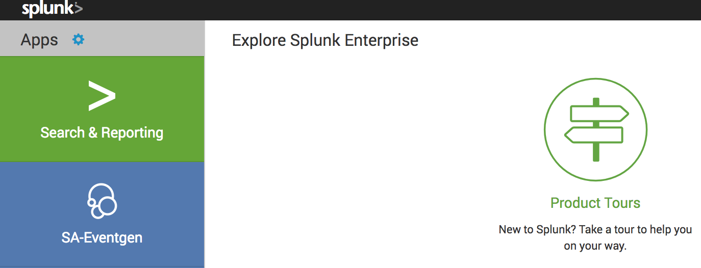

## Install ##

Installing Eventgen is simple. There are a couple of ways to using Eventgen - as a PyPI module and as a Splunk App. Follow the instructions below depending on your ideal use:

* Use Eventgen as a [Splunk App](#splunk-app-installation)
* Use Eventgen as a [Python (PyPI) package](#pypi-installation)


---

##### PyPI Installation #####

To use Eventgen as a PyPI module, you need to download the source code first. Make sure to check that you have a correct branch to build your Eventgen module.

Then run below commands inside Eventgen directory:
```
$ python setup.py sdist

# you should see a tar file inside of dist directory
$ ls dist
splunk_eventgen-6.x.x.tar.gz

$ pip install splunk_eventgen-6.x.x.tar.gz

$ splunk_eventgen --version
Eventgen 6.x.x
```
Now you are ready to use Eventgen as a pip module.

---

##### Splunk App Installation #####

To use Eventgen as a Splunk app, you need a SPL file. In order to generate the SPL file, install Eventgen through PyPI with the instruction above.

Once you have Eventgen installed, run:

```
# This command generates spl file
splunk_eventgen build --destination <DESIRED_PATH_TO_OUTPUT_SPL_FILE>
```

With the generated SPL file, follow these steps to install.
1. Log in to Splunk Web and navigate to Apps > Manage Apps.
2. Click "Install app from file".
3. Navigate to the path where your local SPL file is and select.
4. Restart Splunk after you have been notified of a successful installation.
5. Go to Settings>Data inputs.
5. Verify that SA-Eventgen shows up under Local inputs.

OR

Use this Splunkbase link to download a Splunk app:
https://splunkbase.splunk.com/app/1924/

---

## Configure ##

Now you probably wonder about how much data should Eventgen send? Or where should Eventgen send data to? Or how does Eventgen send data? Or what type of data do you want Eventgen to send?
After Eventgen is installed in any of the forms mentioned above, it is time to configure Eventgen.
There are two key concepts behind the configuration process of Eventgen:

* `eventgen.conf`: This is a ini-style configuration file that Eventgen parses to set global, default, and even sample-specific settings. These settings include which plugin to use, how much data to send, and where to send it to. For more information, see [this section](TUTORIAL.md#the-configuration-file).
* `sample files`: This is a collection of text files that Eventgen will read on initiation. Samples act as templates for the raw data that Eventgen pumps out. As such, these templates can include tokens or specific replacement strings that will get modified during processing-time (ex. timestamps updated in real-time). For more information, see [this section](TUTORIAL.md#the-sample-file).

In addition, common use cases work around bundling these relevant files.
Because Eventgen configs can be tightly coupled with custom sample files, they can be bundled up into a package itself, in the format:
```
bundle/
	default/
		eventgen.conf
	samples/
		users.sample
		hosts.sample
		firewall.logs
```
If you have not read the sections below, please do so first and revisit bundling your files.

Based on your Eventgen installation, perform one of the following to set up Eventgen:

* Configuring Eventgen as a [Splunk App](#splunk-app-setup)
* Configuring Eventgen as a [Python (PyPI) package](#pypi-setup)

##### Splunk App Setup #####

Before you start, confirm that you have successfully installed SA-Eventgen app using this instruction [Splunk App Installation](#splunk-app-installation).

You should see SA-Eventgen App in SplunkWeb.


You should see SA-Eventgen as an input under Settings>Data inputs


Additionally, you'll see SA-Eventgen in your Splunk apps installation directory:
```
$ cd ${SPLUNK_HOME}/etc/apps
```

If SA-Eventgen App is correctly installed, there is no additional configuration required. SA-Eventgen app will automatically identify with any apps with Eventgen.conf and start generating data with that config when modinput is enabled.

If you wish you add your bundle so that modinput can detect your package:
Package your eventgen.conf and sample files into a directory structure as outlined above. After that's done, copy/move the bundle into your `${SPLUNK_HOME}/etc/apps/` directory and restart Splunk. If you have specific samples enabled in your eventgen.conf, you should see data streaming into the specified Splunk index.

---

##### PyPI Setup #####

The PyPI can be used in one of two ways: to run Eventgen from the command-line pointing to a specific configuration file, or to replicate the controller-server clustered architecture that the container is using.

### Command Line ###

Assuming you've followed the above steps on installing the PyPI, run the following command and point it to an eventgen.conf file:

```
# Invoke python module
$ python -m splunk_eventgen -v generate tests/sample_eventgen_conf/replay/eventgen.conf.replay

# Alternatively, you can use the `splunk_eventgen` alias
$ splunk_eventgen -v generate path/to/eventgen.conf
```

### Controller/Server Cluster ###

A quick preface on this mode of operation: due to its complexity, this is only recommended if you're developing or comfortable with technical setups. Having said that, you can follow these instructions:

1. Install and run [RabbitMQ](https://www.rabbitmq.com/download.html) locally
2. Install [Eventgen PyPI module](SETUP.md#pypi-setup)
3. To set up a controller, run `splunk_eventgen service --role controller`
4. To set up a server, run `splunk_eventgen service --role server`
5. By default, the controller and server will try to locate RabbitMQ on pyamqp://localhost:5672 using credentials guest/guest and RabbitMQ's web UI at http://localhost:15672
6. You can change any of those parameters using the CLI - for instance, if your RabbitMQ is accessible on rabbit-mq.company.com with credentials admin/changeme you should run `splunk_eventgen service --role controller --amqp-host rabbit-mq.company.com --amqp-user admin --amqp-pass changeme`
7. Please see `splunk_eventgen service --help` for additional CLI options
8. **NOTE:** Running the controller and server on the same machine will cause port collisions for Eventgen web server. To mitigate this, you can tell the server to run on a separate port using `splunk_eventgen service --web-server-address 0.0.0.0:9501`

---